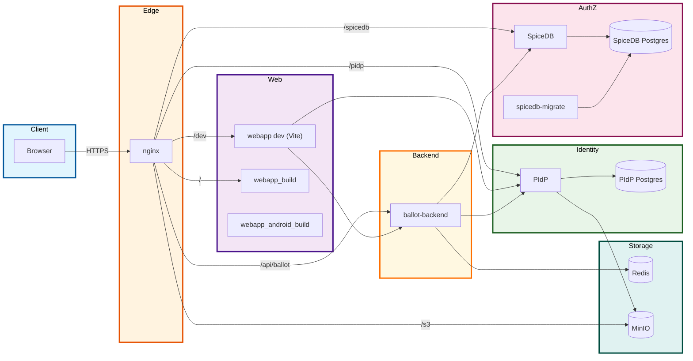

# Architecture

This document summarizes the services created by `run.py` and how they connect.

## Services (from `run.py`)

- **nginx** (`nginx:latest`)
  - Terminates TLS, routes `/dev`, `/pidp`, `/api/ballot`, `/s3`, `/minio`, `/spicedb`.
  - Serves static build from `webapp-build/`.
- **webapp** (`node:23`)
  - Vite dev server on `:5173` (proxied via nginx `/dev`).
- **webapp_build** (`node:23`)
  - Builds production bundle to `webapp-build/`.
- **webapp_android_build** (`ghcr.io/cirruslabs/android-sdk:34`)
  - Builds Android APKs via Capacitor/Gradle.
- **PIdP** (`pidp`)
  - Identity/auth service (FastAPI).
- **PIdP Postgres** (`postgres:15-alpine`)
  - Database for PIdP.
- **redis** (`redis:7-alpine`)
  - Ballot backend storage (initiatives, signatures, votes, comments).
- **minio** (`minio/minio:latest`)
  - Object storage (avatars, uploads).
- **spicedb-postgres** (`postgres:15-alpine`)
  - Datastore for SpiceDB.
- **spicedb-migrate** (`authzed/spicedb:latest`)
  - One-shot migration job for SpiceDB.
- **spicedb** (`authzed/spicedb:latest`)
  - Authorization service (relationships/permissions).
- **ballot-backend** (`ballot-backend`)
  - API for initiatives, signatures, votes, comments, admin actions.

## Mermaid Diagram

